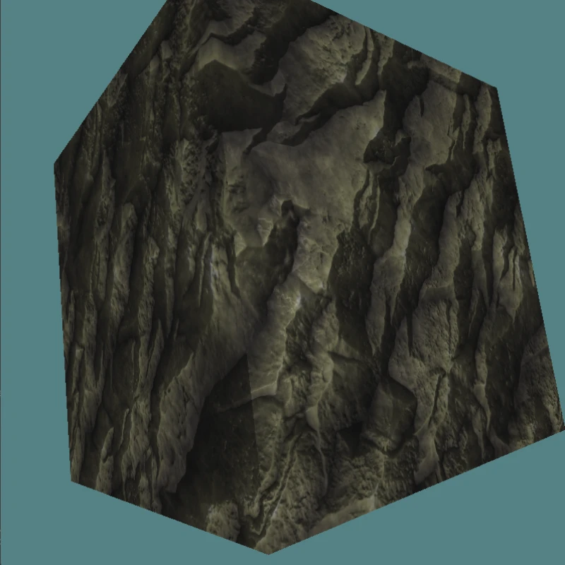

# GFX DEMO
No nonsense, no framework, no bloat, just examples of rendering techniques
(currently only in Direct3D 12)

## Goals
- Small, self-contained implementations of various rendering techniques
- Each demo is contained within its own file, i.e. one .hpp and .cpp per demo
- Each demo demonstrates _one_ technique or feature
- The code is focused on the demo, use well-known libraries like stbi and assimp
  if the demo _requires_ it

Not really a goal, but if files can be diffed to find out the difference
between, for instance, using the input assembler and vertex pulling, that is
encouraged.

Some code can be shared between demos, like window size, backbuffer count, or
anything else that is common for all demos.

## Non-goals
- Production ready code. The demos do not aim to be as efficient as possible

## Basic demos
Most of these demos build on top of the previous demo. See description

|Demo name|Screenshot|Description|
|---|:-:|---|
|ndc_triangle|| Most basic triangle in DirectX12. The triangle is defined in ndc-coordinates in the shader so no vertex buffer is required |
|vertex_triangle_ia vertex_triangle_pull|| Builds on top of ndc_triangle by rendering with a vertex buffer. Uses either the input assembler or vertex pulling. The following demos do not use vertex pulling since multiple vertex buffers hasn't been showcased yet |
|spinning_triangle|| Builds on top of vertex_triangle demo by adding a transform constant buffer which updates every frame |
|spinning_quad|| Builds on top of spinning_triangle by rendering with a index buffer |
|spinning_cat|| Builds on top of spinning_quad by adding uv coordinates in a separate vertex buffer and texturing the quad |
|perspective_cat|| Builds on top of spinning_cat by adding a perspective projection |
|cubed_cat|| Builds on top of perspective_cat by making the quad a cube |
|placed_cat|| Builds on top of cubed_cat by using placed resources instead of committed resources |
|normal_mapping|| Builds on top of cubed_cat by adding adding multiple things: normal mapping, assimp for asset loading, and a counter to dynamically calculate buffer offsets. Comes in two variants: world space and tangent space normal mapping |

## Attribution

Thank you [OpenAI dall-e](https://openai.com/product/dall-e-2) for the cats  
Thank you Brian from [FreePBR](https://freepbr.com/) for the actual textures
